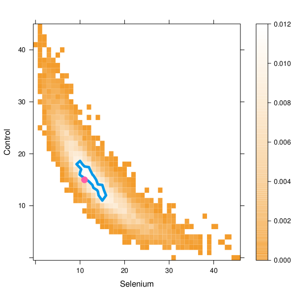

## Mark Fredrickson

Mark received his PhD in Statistics from the University of Illinois at
Urbana-Champaign in 2018 (dissertation chairs: Yuguo Chen and Jake Bowers).
Additionally, he holds an MA in Political Science, also from UIUC. Mark's
research interests include causal inference, networks, computational statistics,
and social science applications. Recent projects include developing new tests of
causal impacts of randomized treatments on networks (as pictured in the distribution below), fast approximations for
estimating attributable effects in randomized trials, and improved estimators of
average treatment effects for subgroups composed of individuals in cluster
randomized trials. Mark maintains the `RItools` and `optmatch` packages for R,
both available on CRAN.

