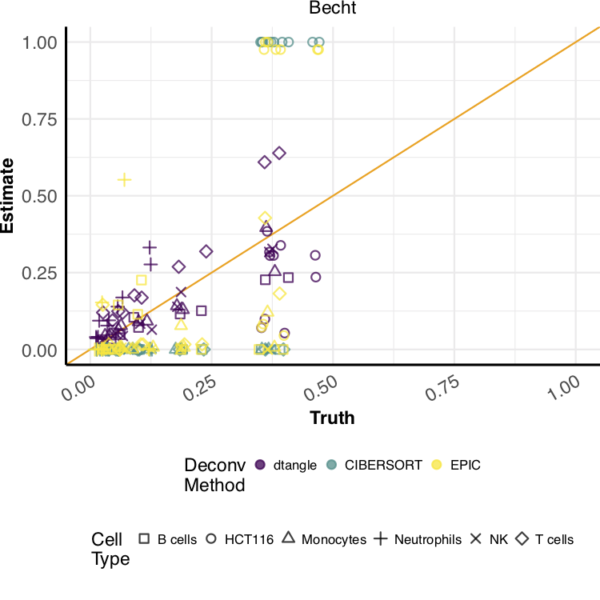

## Gregory Hunt

The method developed by Hunt (dtangle) improves on existing deconvolution methods to more accurately estimate proportions of white blood cell types and cancer cells in blood extracted from patients.

Hunt's work focuses on methods for the analysis of high-dimensional scientific data, especially data from high-throughput
biological experiments. Currently, he is developing methods that aid analysis of genomic, epigenomic, and proteomic data.
In particular he has been working on projects to:

1. recover cell type proportions from high-throughput genomic data, and
2. estimate the correct transformation to retrieve low-rank approximations of data.
