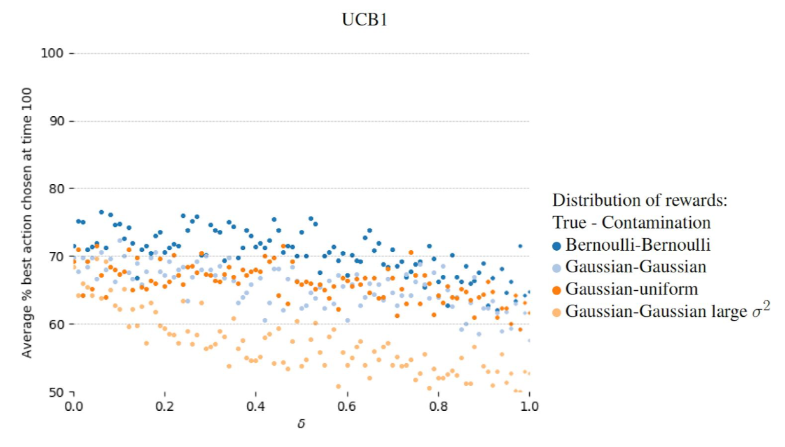

## Laura Niss

Laura’s research is motivated by problems that arise when applying multi-armed bandit algorithms for personalized education. Student behavior does not always conform to standard theoretical assumptions made in the literature on bandit algorithms. For instance, students might guess when they do not know the problem solution, or to they might choose arbitrary answers (in a multiple choice problem) when there is no consequence to their grade or when they are bored or tired. This has led to a focus on robust bandit algorithms. While there has been some work on robustness to heavy tailed rewards, there is little literature on dealing with arbitrary or adversarial corruption in rewards. 

The figures below shows that even in simple corruption scenarios with two possible stochastic actions, stochastic corruption, and with the proportion of corruption (horizontal axis) less than the difference between reward means, there is still a noticeable effect on how often the best action is chosen after 100 rounds (vertical axis). 

