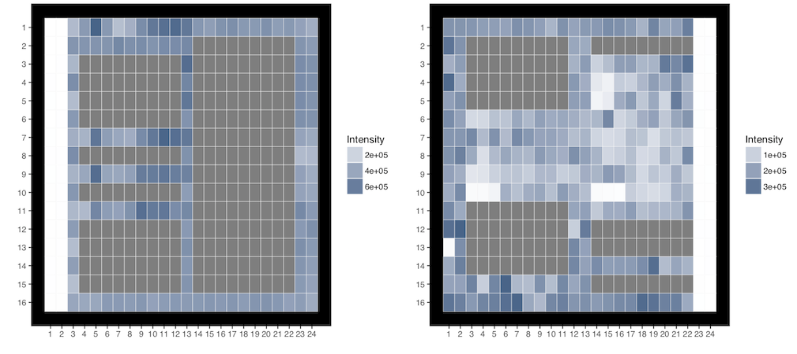

## Zoe Rehnberg

Zoe's research focuses on the analysis of large-scale drug screening data and, specifically, on the reproducibility of results
in replicated screens of anti-cancer drugs on cancer cell lines. Raw data collected from a drug screening study are typically
used to fit dose-response curves and to estimate half-maximal inhibitory concentration (IC50) values. These values are used to
summarize drug efficacy. In replicate screens, however, there seems to be little concordance between the IC50 estimates,
suggesting problems in the data collection and analysis processes. An investigation into this lack of replicability in
rescreened drugs has led to the identification of several sources of irreproducibility in IC50 estimates. These range from
problems in data collection (large technical errors, spatial bias, extremely noisy screens) to concerns about data analysis
procedures (normalization of raw intensity measurements and assumptions of sigmoid dose-response curves). These sources of
irreproducibility manifest in many different ways, and many seem to work in conjunction with each other, making it difficult
to correct for their complex effects. Improving quality control methods, Zoe's current focus, may help to flag some of the
most problematic cases and improve the overall integrity of the data.

The figure below shows the heatmaps of raw drug screening data collected in 384-well plates. Wells around the edges of the
plates and in the central column(s) are controls, while the remainder of the wells are treated, with drugs applied in nine
decreasing concentrations. Grey wells indicate missing data. The heatmap on the left shows an example of local spatial
effects, with a checkerboard pattern in the controls in column 3 and a clear pattern of high and low intensities in the
drugged wells in rows 7, 9, and 11. The heatmap on the right shows an extremely noisy plate, where the noise conceals any
biological effects. The data are from the Genomics of Drug Sensitivity in Cancer project.

