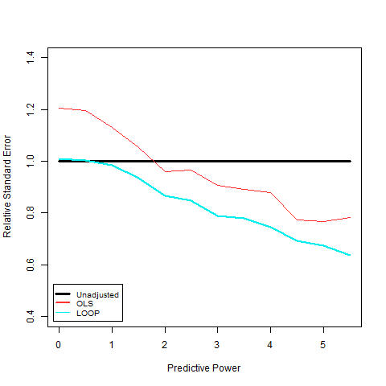

## James (Ed) Wu

Ed’s research focuses on the analysis of randomized experiments and more specifically, covariate adjustments in randomized experiments. To illustrate, suppose we are interested in the effect of a medication on blood pressure. After randomizing the participants into treatment and control, we may find that the treatment group is older on average than the control group. We also know that blood pressure is positively correlated with age and we may wish to account for the imbalance of the treatment groups when estimating the effect of the treatment. The LOOP estimator is a flexible covariate adjustment method that uses a leave-one-out procedure to impute each subject's potential outcomes (potential outcomes represent the outcomes that would be observed for a participant when assigned to treatment or control). The estimation of the potential outcomes can be done using any existing prediction method (such as a random forest, decision tree, or linear regression). However, regardless of the imputation method, the estimator remains unbiased. In addition, the method generally performs at least as well as the unadjusted estimator and using random forests essentially allows for automatic variable selection.

In the figure below, we compare the LOOP estimator to the unadjusted estimator and ordinary least squares (“OLS”) in a simulation study. For this simulation, we have simulated 200 hypothetical participants and 50 uninformative covariates. We also generate a single predictive covariate. On the x-axis, we have the predictive power of the informative covariate, with 0 meaning the variable is not predictive. On the y-axis, we have the standard error relative to the standard error of the unadjusted estimator. We can see that even when the covariate is not predictive, the LOOP estimator performs as well as the unadjusted estimator, while OLS does worse. As the predictive power of the covariate increases, the relative performance of the LOOP estimator does as well.

